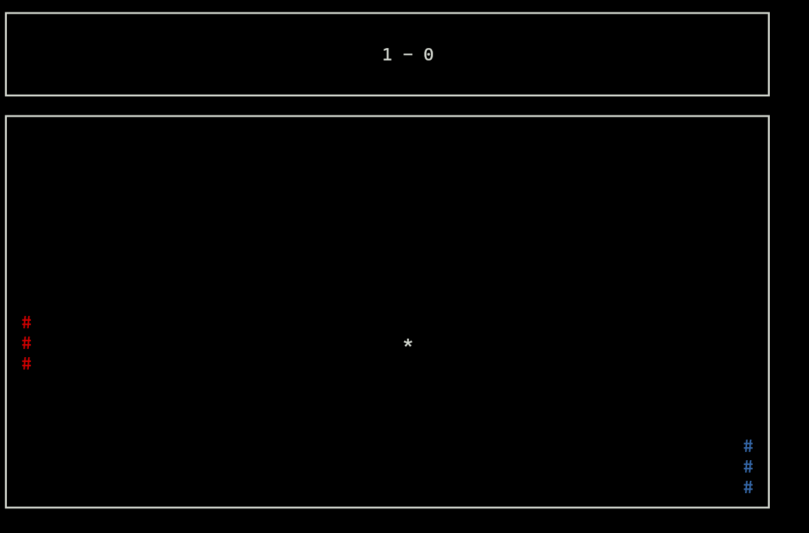
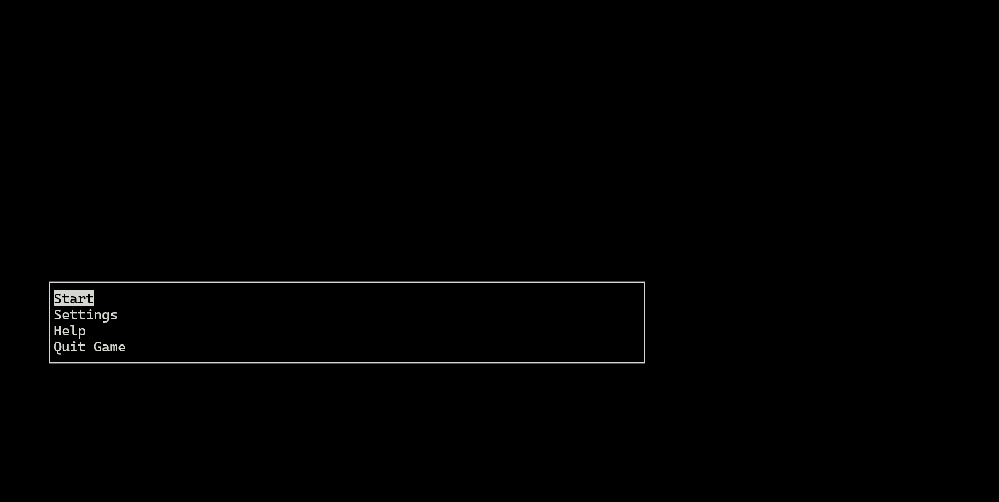
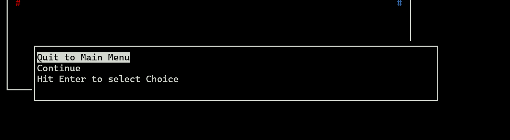
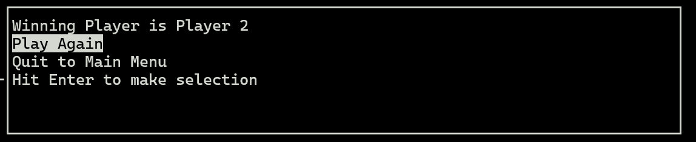
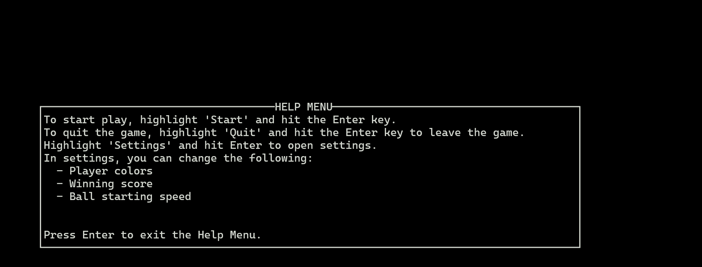
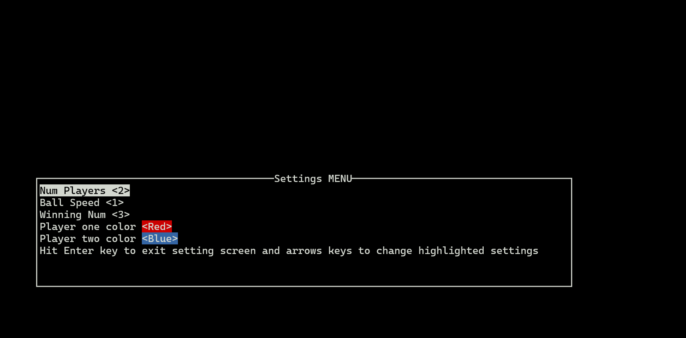

# Robert and Troy's Pong :tm:

### Project 
Our goal for this project is to make a ncurses pong. The goal of the DIY lab was to learn a new library ncurses.
We implemented a threaded pong game. Using the ncurses library we were able to get keyboard input and make 
a great game with different color paddles and speed variations for the ball. We implemented many different menus that you may see in a common 
game today. The big one is the pause menu which uses a semaphore to lock the ball position and stop players from being able to make keystrokes.

### Images of Gameplay and menus

#### Base game Play

#### Main Menu

#### Pause Menu

#### End Menu

#### Help Menu

#### Settings Menu

